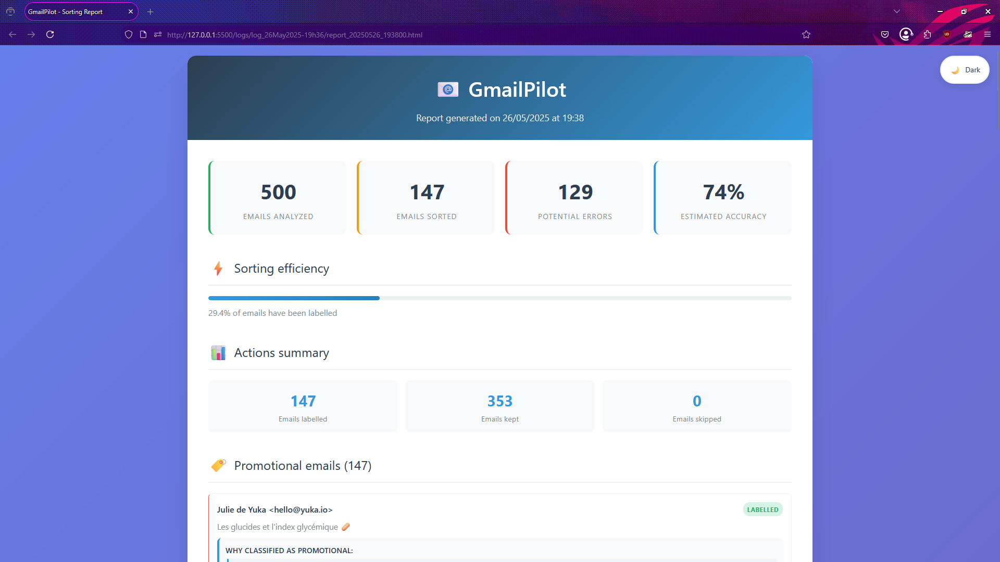
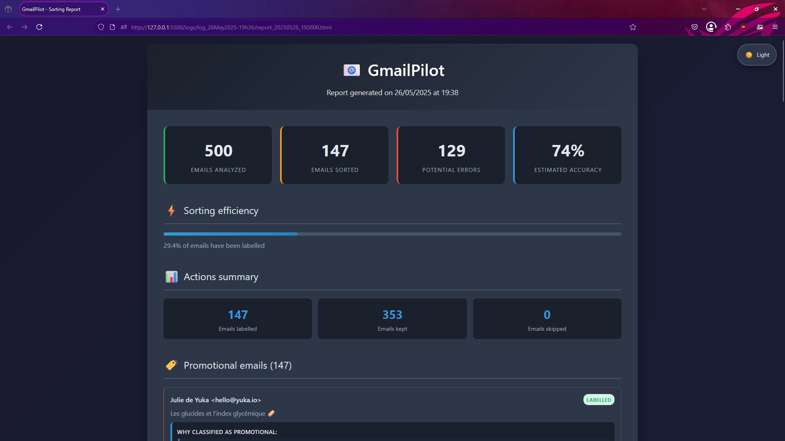

# 🚀 GmailPilot

[](https://github.com/0xMR007/GmailPilot/releases)
[](https://www.python.org/downloads/)
[](https://opensource.org/licenses/MIT)
[](https://www.sbert.net/)
[](https://github.com/Textualize/rich)
[](https://www.crummy.com/software/BeautifulSoup/)
[](https://jinja.palletsprojects.com/)

**Clean your Gmail inbox automatically with artificial intelligence**

*🇫🇷 [Version française disponible ici](README_FR.md)*

<div align="center">
  <p>
    
    
  </p>
</div>

## 🗂️ Table of Contents

- 🎯 [Purpose](#purpose)
- ✨ [Key Features](#key-features)
- 🤔 [How It Works](#how-it-works)
- 🏗️ [Project Structure](#project-structure)
- 🚀 [Quick Start](#quick-start)
    - 📋 [Prerequisites](#prerequisites)
    - 🌐 [Installation](#installation)
    - 🏃‍➡️ [First run](#first-run)
- 🔧 [Configuration](#configuration)
- 📁 [Generated Files After Analysis](#generated-files-after-analysis)
- 📚 [Training Dataset](#training-dataset)
- 📊 [Expected Results](#expected-results)
- 🔒 [Security & Privacy](#security--privacy)
- 🐛 [Common Issues](#common-issues)
- 🤝 [Contributing](#contributing)
- 📜 [License](#license)
- 💬 [A little word](#a-little-word)
- 📜 [Legal Notice](#legal-notice)

## Purpose

GmailPilot uses **SBERT artificial intelligence** to automatically identify promotional emails in your Gmail inbox and organize them for you. No more manual sorting needed !

**In practice :**
- ⚡ **Fast analysis** : Process hundreds of emails in minutes
- 🤖 **Advanced AI** : Uses SBERT to understand email content semantically
- 🛡️ **Smart protection** : Preserves your important emails (banking, health, work)
- 📊 **Detailed reports** : Web interface to visualize results + logs and CSV files for external analysis
- 🔒 **100% local** : Your emails stay on your machine

---

## Key Features

### 🧠 **Intelligent Classification**
- **SBERT (Semantic AI)** : Understands the real meaning of emails
- **Contextual analysis** : Examines conversations and history
- **Importance detection** : Automatically protects critical emails
- **Hybrid scoring** : Combines AI and custom rules

### 📱 **User Interface**
- **Interactive CLI** : Simple and guided command-line interface
- **Preview mode** : Visualize changes before applying them
- **HTML reports** : Responsive dashboards with light/dark themes
- **CSV export** : Complete data for external analysis

### 🔐 **Security & Privacy**
- **Local processing** : No data sent to the Internet (except for the secure exchange with the Google API)
- **OAuth 2.0** : Secure authentication with Google
- **Revocable access** : Control permissions from your Google account
- **Open source** : Complete transparency of operation

---

## **How It Works**

### **Step 1 : Email Analysis**
```
📧 Email Input → 🔍 Content Analysis → 🤖 AI Classification & 📋 Rules Scoring -> 📊 Reports
```

### **Step 2 : Hybrid Decision**
- **SBERT Model** : Analyzes language patterns and promotional indicators
- **Rule Engine** : Checks sender domains, subject patterns, and content markers
- **Context Analysis** : Reviews thread history and sender interactions
- **Final Score** : Weighted combination with confidence rating

### **Step 3 : Safe Processing**
- **Dry Run** : Preview all changes before execution
- **Confidence Thresholds** : Only act on high-confidence classifications
- **Error Detection** : Flag borderline cases for manual review
- **Detailed Logging** : Complete audit trail of all decisions

---

## Project Structure

```bash
GmailPilot/
├── assets/                    # Visuals and preview images
├── data/dataset.csv           # Training data & cache files (the provided file is only in EN/FR)
├── logs/                      # Processing logs and reports
├── models/                    # Pre-trained SBERT model (auto-generated)
├── src/                       # Main source code directory
│   ├── __init__.py            # Package initialization
│   ├── authenticator.py       # Gmail authentication handler
│   ├── cli.py                 # Command-line interface and user menus
│   ├── config.py              # Configuration and thresholds
│   ├── context_classifier.py  # Context and thread analysis
│   ├── email_manager.py       # Email processing and management logic
│   ├── email_utils.py         # Email-specific utility functions and processing logic
│   ├── gmail_client.py        # Gmail API client for email retrieval and metadata operations
│   ├── html_reporter.py       # HTML report generation and formatting
│   ├── hybrid_classifier.py   # Combined SBERT + rule-based classification
│   ├── importance_classifier.py # Important email detection logic (rules)
│   ├── logger.py              # Logging system
│   ├── main.py                # Main file for running the tool
│   ├── promo_classifier.py    # Promotional email detection rules
│   ├── sbert_classifier.py    # Text classification model
│   ├── semantic_analyzer.py   # Semantic content analysis
│   ├── temporal_analyzer.py   # Temporal pattern analysis
│   └── utils.py               # Utility functions and helpers
├── templates/
│   └── report_template.html   # HTML report template
├── .gitignore                 # Git ignore file
├── credentials.json           # Credentials Gmail API (provided by user)
├── LICENSE                    # MIT license file
├── README.md                  # Project documentation
├── requirements.txt           # Python dependencies
└── token.json                 # OAuth token (auto-generated)
```

---

## **Quick Start**

### **Prerequisites**
- Python 3.9 or higher (recommended 3.10-3.12)
- Gmail account with API access
- [sentence-transformers](https://www.sbert.net/) Python package (SBERT model)
    - All dependencies are installed automatically via `requirements.txt`

### **Installation Notes :**

> Normally, you can install all dependencies with a single command :

```bash
pip install -r requirements.txt
```

> If any module fails to install, consider installing it separately.
> And check the documentation of the corresponding package for more information.


### **Setup Gmail API**
1. Visit [Google Cloud Console](https://console.cloud.google.com/)
2. Create a new project or select existing
3. Enable Gmail API
4. Create OAuth 2.0 credentials (Desktop Application)
5. Download `credentials.json`

### **Installation**
```bash
# Clone the repository
git clone https://github.com/0xMR007/GmailPilot.git
cd GmailPilot

# Create and activate a virtual environment (recommended)
python3 -m venv venv
source venv/bin/activate # Linux/Mac
# or
.\venv\Scripts\activate # Windows

# Install dependencies inside the virtual environment
pip install -r requirements.txt

# Place your credentials file
# Copy credentials.json to the project root directory
```

### **First Run**
```bash
# Start the tool
python -m src.main

# Follow the interactive menu:
# 1. Authenticate with Gmail
# 2. Run analysis (dry-run recommended first)
# 3. Review HTML report
# 4. Process emails when satisfied
```

---

## Configuration

Main settings are in `src/config.py`:

```python
# Classification thresholds
PROMO_THRESHOLD = 0.60           # Promotional detection threshold (0.0-1.0)
IMPORTANCE_THRESHOLD = 5.5       # Important email protection (0-10)

# AI model weights
SBERT_WEIGHT = 0.6              # SBERT model weight
RULES_WEIGHT = 0.6              # Custom rules weight

# Performance
MAX_RESULTS = 50                # Emails processed per session (max 500)
BATCH_SIZE = 20                 # API batch size
```

**Configurable parameters:**
- **MAX_RESULTS**: Emails processed per session (default: 50, max: 500)
- **BATCH_SIZE**: API batch size for Gmail (default: 20)
- **Classification thresholds**: PROMO_THRESHOLD and IMPORTANCE_THRESHOLD

**Available performance profiles:**
- **Balanced** (default): Good speed/accuracy compromise
- **Fast**: Faster processing, reduced accuracy
- **Maximum**: Fastest, basic analysis only

---

## Expected Results

### **Before GmailPilot**
- 📧 **15-30 min/day** wasted sorting emails
- ❌ **15-20% promotional emails** slip through
- 📈 **Constant accumulation** of unwanted mail

### **After GmailPilot**
- ⚡ **Fast and efficient** — process hundreds of emails in just a few minutes
- 🎯 **85-95% accuracy** thanks to the hybrid classification system
- 📉 **60-80% reduction** in promotional clutter
- 📊 **Complete reports** to understand what happened

---

## Generated Files After Analysis

After each analysis, GmailPilot generates several files in the `logs/log_DDMMMYYYY-HHhMM/` folder:

### **📊 Main Reports**
- **`report_YYYYMMDD_HHMMSS.html`** - Interactive report with responsive web interface
- **`detailed_report.md`** - Detailed Markdown report with complete information
- **`report.md`** - Concise analysis summary
- **`report.txt`** - Basic summary in plain text

### **📋 Analysis Data**
- **`classified_emails.csv`** - All analyzed emails with their classifications
- **`all_decisions.csv`** - Complete details of AI decisions
- **`message_ids.txt`** - Gmail IDs list for technical reference

### **🔍 Logs and Debugging**
- **`actions.log`** - Detailed journal of all operations performed
- **`potential_errors.log`** - Edge cases and potential errors detected

### **💡 Recommended Usage**
1. **Check first** the HTML report for an interactive overview
2. **Export** CSV for custom analysis in Excel/Google Sheets
3. **Review** the potential errors file before applying changes

---

## Training Dataset

The `data/dataset.csv` file contains **510+ labeled email examples** used to improve classification accuracy:

### **📋 Data Structure**
```csv
text,label
"Special offer just for you!",1         # Promotional email
"Your May electricity bill",0           # Important email
"🔥 MEGA SALE: 70% OFF everything!",1   # Promotional email
```

### **🏷️ Labeling System**
- **`0`** = Important email (bills, health, work, administrative)
- **`1`** = Promotional email (marketing, ads, commercial newsletters)

### **🌍 Multilingual Content**
- **French**: ~60% of examples
- **English**: ~40% of examples
- **Covered domains**: E-commerce, finance, health, administration, marketing

### **🎯 Usage**
This dataset helps the SBERT model better understand:
- **Language patterns** of promotional emails
- **Importance indicators** (urgency, institutions, etc.)
- **Cultural variations** between French and English

---

## Security & Privacy

✅ **100% local processing** - Your emails never leave your computer  
✅ **OAuth 2.0 authentication** - Industry security standard  
✅ **Minimal permissions** - Access only to necessary functions  
✅ **Metadata cache only** - No email content stored  
✅ **Open source code** - Complete transparency for verification  

---

## Common Issues

**Installation:**
- Ensure you have Python 3.8+ and at least 4GB RAM
- Verify that `credentials.json` is in the root folder
- `OSError: [Errno 28] No space left on device` : Check your disk space
  - `df -h` to check disk space
  Cause: Some dependencies (like nvidia_nccl_cu12) are very large (~200MB) and can fill up the temporary /tmp partition during installation.
  Solution : Add a swap partition or increase the size of the /tmp partition. OR install using **CPU only** of PyTorch :
  ```bash
  pip install torch torchvision torchaudio --index-url https://download.pytorch.org/whl/cpu
  ```
  Then install the rest of the requirements without pulling heavy dependencies again :
  ```bash
  pip install -r requirements.txt --no-deps	
  ```

**Performance:**
- Adjust `MAX_RESULTS` to process fewer emails at once
- Use performance profiles to optimize speed

**Authentication:**
- Verify Gmail API is enabled in Google Cloud Console
- Delete `token.json` to force re-authentication

---

## Contributing

Contributions are welcome! You can:
- 🐛 Report bugs
- 💡 Suggest improvements
- 🔧 Submit code
- 📖 Improve documentation

---

## License

This project is under MIT License. See [LICENSE](LICENSE) file for details.

### **Libraries Used**
- [Sentence Transformers](https://www.sbert.net/) - Semantic AI analysis
- [Google API Client](https://github.com/googleapis/google-api-python-client) - Gmail integration
- [Rich](https://github.com/Textualize/rich) - Enhanced CLI interface
- [Beautiful Soup](https://www.crummy.com/software/BeautifulSoup/) - HTML analysis
- [Jinja2](https://jinja.palletsprojects.com/) - Report generation

---

## A little word

GmailPilot is a **personal project** made to learn and experiment.  
It may sometimes (and it will surely) be wrong or misclassify certain emails.

Please **check the results** before validating anything.  
I decline any responsibility if an important message is misclassified 😅

---

## Legal Notice

This project is not affiliated with, endorsed by, or sponsored by Google or Gmail.
"Gmail" is a registered trademark of Google LLC.

This project uses the Gmail API in compliance with its terms of service and is intended for educational or personal use only.

<div align="center">

**⭐ Star this repo if GmailPilot helps you manage your inbox better!**

[Report Bug](https://github.com/0xMR007/GmailPilot/issues) • [Request Feature](https://github.com/0xMR007/GmailPilot/issues)

<i>Made with ❤️ by a passionate student</i>

</div> 