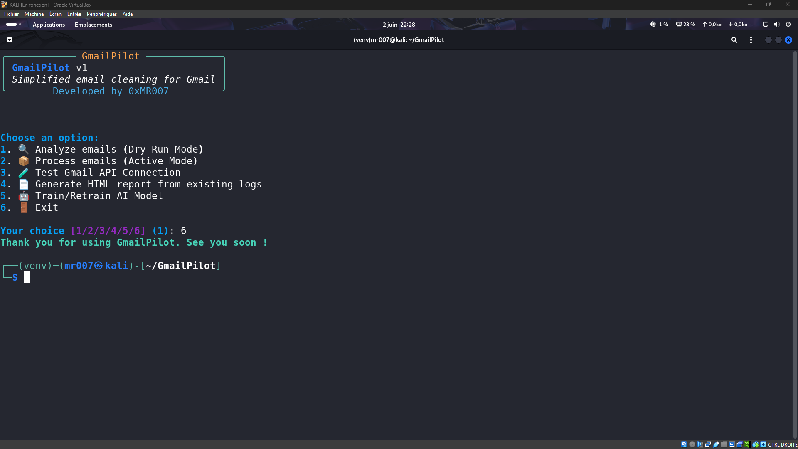

# 🚀 GmailPilot

[](https://github.com/0xMR007/GmailPilot/releases)
[](https://www.python.org/downloads/)
[](https://opensource.org/licenses/MIT)
[](https://www.sbert.net/)
[](https://github.com/Textualize/rich)
[](https://www.crummy.com/software/BeautifulSoup/)
[](https://jinja.palletsprojects.com/)

**Nettoyez votre boîte Gmail automatiquement avec l'intelligence artificielle**

*🌍 [English version available here](README.md)*

<div align="center">
  
  <p>
    
    
  </p>
</div>

## 🗂️ Sommaire

- 🎯 [Objectif](#objectif)
- ✨ [Fonctionnalités principales](#fonctionnalités-principales)
- 🤔 [Comment ça marche](#comment-ça-marche)
- 🚀 [Démarrage rapide](#démarrage-rapide)
    - 📋 [Prérequis](#prérequis)
    - 🌐 [Installation](#installation)
    - 🏃‍➡️ [Premier lancement](#premier-lancement)
- 🔧 [Configuration](#configuration)
- 🏗️ [Structure du projet](#structure-du-projet)
- 📁 [Fichiers générés après analyse](#fichiers-générés-après-analyse)
- 📚 [Dataset d'entraînement](#dataset-dentraînement)
- 📊 [Résultats attendus](#résultats-attendus)
- 🔒 [Sécurité & vie privée](#sécurité--vie-privée)
- 🐛 [Problèmes courants](#problèmes-courants)
- 🤝 [Contribuer](#contribuer)
- 📜 [Licence](#licence)
- 💬 [Juste un petit mot](#juste-un-petit-mot)
- 📜 [Mentions légales](#mentions-légales)

## Objectif

GmailPilot utilise un **modèle d'intelligence artificielle** *SBERT* pour identifier automatiquement les e-mails promotionnels dans votre boîte Gmail et les organiser à votre place. Plus besoin de trier manuellement !

Le but de ce projet est de permettre à n'importe qui de trier ses emails de façon automatique et efficace, mais aussi d'améliorer l'algorithme de tri de Gmail.

Et oui ! Gmail contient déjà un algorithme de tri, et en utilisant GmailPilot, vous aidez à organiser vos emails de façon cohérente.
À force de trier les emails avec des labels spécifiques, vous créez des motifs que Gmail peut potentiellement reconnaître pour ses futurs classements automatiques.

**En pratique :**
- ⚡ **Analyse rapide** : Traite des centaines d'emails en quelques minutes
- 🤖 **IA avancée** : Utilise SBERT pour comprendre le contenu des emails
- 🛡️ **Protection intelligente** : Préserve vos emails importants (banque, santé, travail)
- 📊 **Rapports détaillés** : Interface web pour visualiser les résultats + logs et fichier CSV pour analyse externe
- 🔒 **100% local** : Vos emails restent sur votre machine

---

## Fonctionnalités principales

### 🧠 **Classification intelligente**
- **SBERT (IA sémantique)** : Comprend le sens réel des emails
- **Analyse contextuelle** : Examine les conversations et historiques
- **Détection d'importance** : Protège automatiquement les emails critiques
- **Scoring hybride** : Combine IA et scoring basé sur des règles personnalisées

### 📱 **Interface utilisateur**
- **CLI interactif** : Interface en ligne de commande simple et guidée
- **Mode aperçu** : Visualisez les changements avant de les appliquer
- **Rapports HTML** : Tableaux de bord responsifs avec thèmes clair/sombre
- **Export CSV** : Données complètes pour analyse externe

### 🔐 **Sécurité & confidentialité**
- **Traitement local** : Aucune donnée n'est envoyée sur Internet (à l'exception des échanges sécurisés avec l'API Google)
- **OAuth 2.0** : Authentification sécurisée avec Google
- **Accès révocable** : Contrôlez les permissions depuis votre compte Google
- **Code opensource** : Transparence totale du fonctionnement

---

## 🚀 Installation rapide

### **1. Configurer l'API Gmail**
1. Allez sur [Google Cloud Console](https://console.cloud.google.com/)
2. Créez un projet et activez l'API Gmail
3. Créez des identifiants OAuth 2.0 (Application de bureau)
4. Téléchargez le fichier `credentials.json`

### **2. Installer GmailPilot**
```bash
# Cloner le projet
git clone https://github.com/0xMR007/GmailPilot.git
cd GmailPilot

# Installer les dépendances
pip install -r requirements.txt

# Placer votre fichier credentials.json dans le dossier du projet
```

### **3. Premier lancement**
```bash
python -m src.main

# Suivez le menu interactif :
# 1. 🔑 S'authentifier avec Gmail
# 2. 🔍 Analyser les emails (mode aperçu)
# 3. 📄 Consulter le rapport
# 4. 📦 Appliquer les changements
```

---

## Comment ça marche

### **Step 1 : Analyse des emails**
```
📧 Email → 🔍 Analyse → 🤖 Classification IA & 📋 Scoring avec règles -> 📊 Rapports
```

### **Step 2 : Décision hybride**
- **SBERT Model** : Analyse les motifs de langage et les indicateurs promotionnels
- **Rule Engine** : Vérifie les domaines expéditeurs, les motifs de sujets et les marqueurs de contenu
- **Analyse contextuelle** : Examine l'historique des conversations et les interactions des expéditeurs
- **Score final** : Combinaison pondérée avec une note de confiance

### **Step 3 : Traitement sûr**
- **Aperçu** : Prévisualise tous les changements avant d'exécuter
- **Seuil de confiance** : N'agisse que sur les classifications de haute confiance
- **Détection d'erreurs** : Marque les cas limites pour une revue manuelle
- **Journalisation détaillée** : Journal complet de toutes les décisions

---

## Démarrage rapide

### **Prérequis**
- Python 3.9 ou plus (recommandé 3.10-3.12)
- Compte Gmail avec accès API
- [sentence-transformers](https://www.sbert.net/) Python package (SBERT model)
    - Toutes les dépendances sont installées automatiquement via `requirements.txt`

### **Notes d'installation :**

> Normalement, vous pouvez installer toutes les dépendances avec une seule commande :

```bash
pip install -r requirements.txt
```

> Si un module échoue à installer, envisagez de l'installer séparément.


### **Configurer l'API Gmail**
1. Visitez [Google Cloud Console](https://console.cloud.google.com/)
2. Créez un nouveau projet ou sélectionnez un existant
3. Activer l'API Gmail
4. Créer des identifiants OAuth 2.0 (Application de bureau)
5. Télécharger `credentials.json`

### **Installation**
```bash
# Cloner le dépôt
git clone https://github.com/0xMR007/GmailPilot.git
cd GmailPilot

# Installer les dépendances
pip install -r requirements.txt

# Placez votre fichier credentials.json dans le dossier du projet
```

### **Premier lancement**
```bash
# Démarrer l'outil
python -m src.main

# Suivez le menu interactif :
# 1. S'authentifier avec Gmail
# 2. Exécuter l'analyse (aperçu recommandé en premier)
# 3. Examiner le rapport HTML
# 4. Traiter les emails lorsque vous êtes satisfait
```

---

## Configuration

Les paramètres principaux sont dans `src/config.py` :

```python
# Seuils de classification
PROMO_THRESHOLD = 0.60           # Seuil de détection promotionnelle (0.0-1.0)
IMPORTANCE_THRESHOLD = 5.5       # Protection des emails importants (0-10)

# Poids des classificateurs
SBERT_WEIGHT = 0.6              # Poids du modèle SBERT
RULES_WEIGHT = 0.6              # Poids des règles personnalisées

# Performance
MAX_RESULTS = 50                # Emails traités par session (max 500)
BATCH_SIZE = 20                 # Taille des lots d'API
```

**Paramètres configurables :**
- **MAX_RESULTS** : Nombre d'emails traités par session (défaut: 50, max: 500)
- **BATCH_SIZE** : Taille des lots pour l'API Gmail (défaut: 20)
- **Seuils de classification** : PROMO_THRESHOLD et IMPORTANCE_THRESHOLD

**Profils de performance disponibles :**
- **Équilibré** (par défaut) : Bon compromis vitesse/précision
- **Rapide** : Plus rapide, précision réduite
- **Maximum** : Le plus rapide, analyse basique uniquement

---

## Résultats attendus

### **Avant GmailPilot**
- 📧 **15 à 30 min par jour** perdues à trier les emails
- ❌ **15-20% d'emails promotionnels** arrivent à se faufiler dans votre boîte
- 📈 **Accumulation constante** de courrier indésirable

### **Après GmailPilot**
- ⚡ **Configuration unique** puis automatisation continue
- 🎯 **85-95% de taux de précision** grâce au modèle SBERT
- 📉 **60-80% de taux de réduction** du courrier promotionnel
- 📊 **Rapports complets** pour comprendre ce qui s'est passé

---

## Structure du projet

```bash
GmailPilot/
├── assets/                    # Assets visuels et images d'aperçu
├── data/dataset.csv           # Données d'entraînement & fichiers de cache
├── logs/                      # Logs et rapports de traitement
├── models/                    # Modèle SBERT pré-entraîné (auto-généré)
├── src/                       # Dossier principal du code source
│   ├── __init__.py            # Initialisation du package
│   ├── authenticator.py       # Gestionnaire d'authentification Gmail
│   ├── cli.py                 # Interface de ligne de commande et menus utilisateur
│   ├── config.py              # Configuration et seuils
│   ├── context_classifier.py  # Analyse du contexte et des threads
│   ├── email_manager.py       # Logique de traitement et de gestion des emails
│   ├── email_utils.py         # Fonctions utilitaires spécifiques aux emails et logique de traitement
│   ├── gmail_client.py        # Client Gmail API pour la récupération et les opérations de métadonnées
│   ├── html_reporter.py       # Génération et formatage du rapport HTML
│   ├── hybrid_classifier.py   # Classification combinée SBERT + logique basée sur les règles
│   ├── importance_classifier.py # Logique de détection des emails importants
│   ├── logger.py              # Système de journalisation
│   ├── main.py                # Fichier principal pour l'exécution de l'outil
│   ├── promo_classifier.py    # Règles de détection des emails promotionnels
│   ├── sbert_classifier.py    # Modèle de classification pour le texte
│   ├── semantic_analyzer.py   # Analyse sémantique du contenu
│   ├── temporal_analyzer.py   # Analyse des motifs temporels
│   └── utils.py               # Fonctions utilitaires et helpers
├── templates/
│   └── report_template.html   # Template Jinja2 pour les rapports HTML
├── .gitignore                 # Fichier ignore Git
├── credentials.json           # Credentials Gmail API (fourni par l'utilisateur)
├── LICENSE                    # Fichier de licence MIT
├── README.md                  # Documentation du projet
├── requirements.txt           # Dépendances Python
└── token.json                 # OAuth token (auto-généré)
```

---

## Fichiers générés après analyse

Après chaque analyse, GmailPilot génère plusieurs fichiers dans le dossier `logs/log_DDMMMYYYY-HHhMM/` :

### **📊 Rapports principaux**
- **`report_YYYYMMDD_HHMMSS.html`** - Rapport interactif avec interface web responsive
- **`detailed_report.md`** - Rapport détaillé au format Markdown avec tous les détails
- **`report.md`** - Résumé concis de l'analyse
- **`report.txt`** - Résumé basique en texte brut

### **📋 Données d'analyse**
- **`classified_emails.csv`** - Tous les emails analysés avec leurs classifications
- **`all_decisions.csv`** - Détails complets des décisions prises par l'IA
- **`message_ids.txt`** - Liste des IDs Gmail pour référence technique

### **🔍 Logs et débogage**
- **`actions.log`** - Journal détaillé de toutes les opérations effectuées
- **`potential_errors.log`** - Cas limites et erreurs potentielles détectées

### **💡 Utilisation recommandée**
1. **Consultez d'abord** le rapport HTML pour une vue d'ensemble interactive
2. **Exportez** le CSV pour des analyses personnalisées dans Excel/Google Sheets
3. **Vérifiez** le fichier des erreurs potentielles avant d'appliquer les changements

---

## 📚 Dataset d'entraînement

Le fichier `data/dataset.csv` contient **510+ exemples d'emails étiquetés** en français et en anglais, utilisés pour améliorer la précision de classification :

### **📋 Structure des données**
```csv
text,label
"Offre spéciale pour vous !",1          # Email promotionnel
"Votre facture du mois de mai",0        # Email important
"🔥 SOLDES : -70% sur tout le site !",1 # Email promotionnel
```

### **🏷️ Système d'étiquetage**
- **`0`** = Email important (factures, santé, travail, administratif)
- **`1`** = Email promotionnel (marketing, publicités, newsletters commerciales)

### **🌍 Contenu multilingue**
- **Français** : ~60% des exemples
- **Anglais** : ~40% des exemples
- **Domaines couverts** : E-commerce, finance, santé, administration, marketing

### **🎯 Utilisation**
Ce dataset permet au modèle SBERT de mieux comprendre :
- Les **patterns linguistiques** des emails promotionnels
- Les **indicateurs d'importance** (urgence, institutions, etc.)
- Les **variations culturelles** entre français et anglais

---

## Sécurité & vie privée

✅ **Traitement 100% local** - Vos emails ne quittent jamais votre ordinateur  
✅ **Authentification OAuth 2.0** - Standard de sécurité de l'industrie  
✅ **Permissions minimales** - Accès uniquement aux fonctions nécessaires  
✅ **Cache métadonnées uniquement** - Aucun contenu d'email stocké  
✅ **Code source ouvert** - Transparence totale pour vérification  

---

## Problèmes courants

**Installation :**
- Assurez-vous d'avoir Python 3.8+ et au moins 4GB de RAM
- Vérifiez que `credentials.json` se trouve bien dans le dossier racine
- `OSError: [Errno 28] Aucun espace disque disponible sur le périphérique` : Vérifiez votre espace disque
  - `df -h` pour vérifier l'espace disque
  Cause : Certaines dépendances (comme nvidia_nccl_cu12) sont très lourdes (~200MB) et peuvent remplir le partition temporaire /tmp lors de l'installation.
  Solution : Ajoutez une partition swap ou augmentez la taille de la partition /tmp. OU installer en utilisant la version **CPU** de PyTorch :
  ```bash
  pip install torch torchvision torchaudio --index-url https://download.pytorch.org/whl/cpu
  ```
  Ensuite, installez les autres dépendances sans récupérer à nouveau les dépendances lourdes :
  ```bash

**Performance :**
- Ajustez `MAX_RESULTS` pour traiter moins d'emails à la fois
- Utilisez les profils de performance pour optimiser la vitesse

**Authentification :**
- Vérifiez que l'API Gmail est activée dans Google Cloud Console
- Supprimez `token.json` pour forcer une nouvelle authentification

---

## Contribuer

Les contributions sont les bienvenues ! Vous pouvez :
- 🐛 Signaler des bugs
- 💡 Proposer des améliorations
- 🔧 Soumettre du code
- 📖 Contribuer à la documentation

---

## Licence

Ce projet est sous licence MIT. Voir le fichier [LICENSE](LICENSE) pour plus de détails.

### **Bibliothèques utilisées**
- [Sentence Transformers](https://www.sbert.net/) - Analyse sémantique IA
- [Google API Client](https://github.com/googleapis/google-api-python-client) - Intégration Gmail
- [Rich](https://github.com/Textualize/rich) - Interface CLI améliorée
- [Beautiful Soup](https://www.crummy.com/software/BeautifulSoup/) - Analyse HTML
- [Jinja2](https://jinja.palletsprojects.com/) - Génération de rapports

---

## Juste un petit mot

GmailPilot est un **projet perso**, fait pour apprendre et expérimenter.  
Il peut parfois (et il le fera sûrement) se tromper ou mal classer certains e-mails.

Pensez à **vérifier les résultats** avant de valider quoi que ce soit.  
Je décline toute responsabilité si un message important est mal trié 😅

---

## Mentions légales

Ce projet n’est ni affilié, ni approuvé, ni soutenu par Google ou Gmail.
"Gmail" est une marque déposée de Google LLC.

Ce projet utilise l’API Gmail dans le respect des conditions d’utilisation et sert uniquement à des fins éducatives ou personnelles.

---

<div align="center">

**⭐ Mettez une étoile si GmailPilot vous aide à mieux gérer votre boîte mail !**

[Signaler un Bug](https://github.com/0xMR007/GmailPilot/issues) • [Demander une Fonctionnalité](https://github.com/0xMR007/GmailPilot/issues)

<i>Développé avec ❤️ par un étudiant passionné</i>

</div>